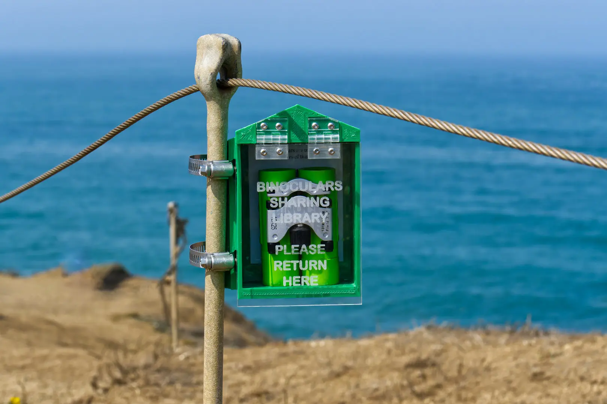
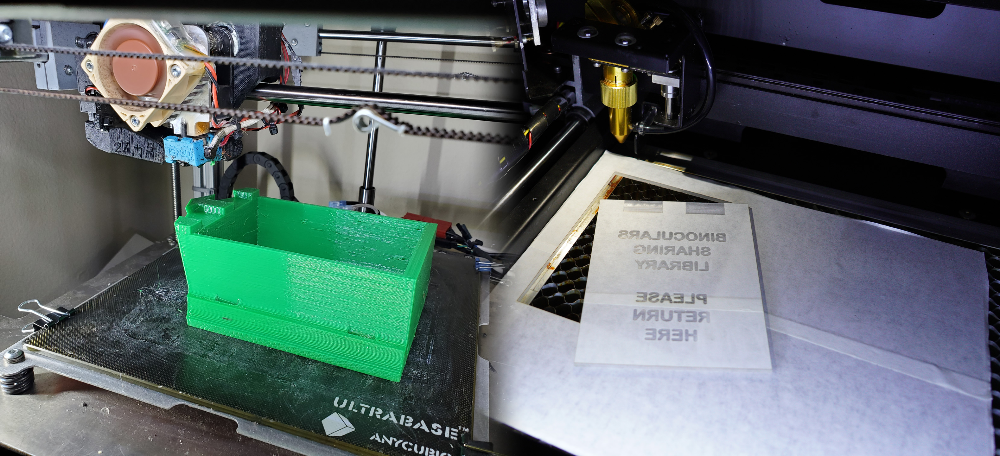

Little homes for binoculars! I build these and place them at public places where I feel people would appreciate a better view of nature.

The first one was installed at a cliff I love visiting, back in July of 2021. Every year, seagulls will nest on the rocks there, and I would come back almost every day to watch baby seagull chicks grow up.

The original barn is a simple box with a pair of 8x21 binoculars inside. The binoculars are to be taken out and expected to be returned back to the box. These are partially inspired by the Little Free Libraries around the neighborhoods, there's even one at the entrance to this very park.

I have received many positive comments about these binoculars. I have overheard kids who were revisiting and expressed how much they looked forward to using the binoculars again. I have had conversations with people, while at another parks, about these binoculars. Somebody even put a magnifying glass underneath my binoculars!

I've since installed two more, next to one of my favorite places to hang out with harbor seals

The boxes are 3D printed using PETG 3D printer filament. The door is made of acrylic sheets that have been laser cut and laser etched.

There are a few design principles prioritizing safety and environmental impact:

 * Must be placed in a safe location, not too close to cliff edges
 * Must not represent a trip hazard, or any other hazard, this means no chains or ropes
 * No sharp components
 * I cannot damage anything during installation, so I've been using pipe straps for mounting
 * It has to look professional enough that people will think it's official
 * I don't think any animals are going to chew on this thing. I do not use any adhesives just in case an animal licks it.
 * I have to commit to monitoring these installations, or else it'd just be littering. So I can only place these where I visit often
 * I use green for high visibility from afar, where appropriate. There are potential installation locations where brown might be more appropriate.
 * Design must handle the climate of the region. There are subtle ways I've prevented water from pooling inside.
 
I didn't care about theft because I visited that location often and can always replenish the box with new binoculars. And... who is actually going to steal these? Kids... kids who love it so much that they pocket it, if they love it so much I just want them to have it.

The second edition of the box features a retractable cable to tether the binoculars, as these are meant to be installed in places I visit less often. The retraction mechanism is actually a small dog leash! I've also updated the components to use stainless steel hinges (vs plastic hinges) and 1/4" thick acrylic (vs 1/8" of the first edition).

This GitHub repo is used for me to keep track of these designs. The designs evolve and I need to be able to reference older designs to repair older installations.

The first installation had problems handling high winds. The door would flap, dirt would get in, and occasionally the hinge would break. Hence why I updated the design to use steel hinges and a thicker heavier door.
